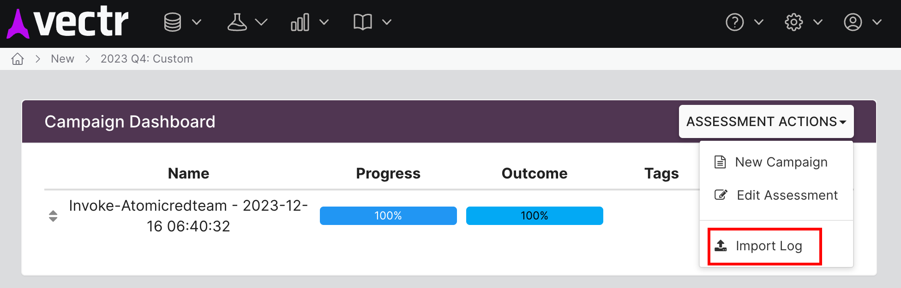

Run [Atomic Red Team](https://atomicredteam.io/) tests in a clean macOS VM.

To open files and links safely, see [ToffeeApple](https://github.com/jonod8698/ToffeeApple)

Use this tool to:
- Generate clean telemetry to create detections without ruining your own machine.
- Speed up the development of macOS Atomic Red Team tests.
- Easily validate detections without additional hardware or licenses.


## Requirements
### Host System
- macOS arm64 / Apple Silicon
- [Tart](https://github.com/cirruslabs/tart)

### Base VM
Installed by `prepare.sh`
- [PowerShell Core](https://github.com/PowerShell/PowerShell)
- [Invoke-AtomicRedTeam](https://github.com/redcanaryco/invoke-atomicredteam)

## Quick Start
1. Clone this repo and install Tart
```zsh
git clone https://github.com/jonod8698/macos-sandbox-vm.git
cd macos-sandbox-vm
brew install cirruslabs/cli/tart
```

2. Download a pre-built Base VM from cirruslabs. Note: To build your own Base VM see [Base VM Customization](#base-vm-customization).
```zsh
tart clone ghcr.io/cirruslabs/macos-ventura-base:latest ventura-base
```

3. Start the VM and configure `softnet` for network isolation.
```zsh
tart run ventura-base --net-softnet
```

3. Close the VM then run `prepare.sh`. Enter the password for the VM when prompted.
```zsh
./prepare.sh
```

4. Run an [Atomic test](https://atomicredteam.io/tags/#macos).
```zsh
./sandbox-atomicredteam.sh -t T1569.001-1 # run test 1 of T1569.001 https://atomicredteam.io/execution/T1569.001/
```

5. Close the VM by typing exit (or Control + C). By default, the temporary VM will be deleted. To keep the VM, add `-d false`.

## Output
Std out will be shown in the terminal and the execution log will be copied to your host.

By default [Attire-ExecutionLog](https://github.com/redcanaryco/invoke-atomicredteam/wiki/Execution-Logging#attire-logger) is enabled, allowing for direct import into [Vectr](https://github.com/SecurityRiskAdvisors/VECTR). After test execution, the log is copied to the host and can be found in the `output` directory.



## Base VM Customization
Ideally the Base VM should be created from an IPSW direct from Apple with additional customizations such as EDR and other security tools applied. This allows for the most accurate telemetry and detection validation. 

Requirements
```
brew install packer
git clone https://github.com/jonod8698/macos-templates.git
cd macos-templates
```

Run packer init
```
packer init templates/vanilla-ventura.pkr.hcl 
```

(Optional) Update IPSW
Go to https://ipsw.me/ and pick the latest image for your device. 

Change `from_ipsw  = <new IPSW link starting with https://updates.cdn-apple.com/*>`

Run packer build
```
packer build templates/vanilla-ventura.pkr.hcl
```

The output should look like this:
```
tart-cli.tart: output will be in this color.

==> tart-cli.tart: Creating virtual machine...
==> tart-cli.tart: Waiting 30s to let the Virtualization.Framework's installation process to finish correctly...
==> tart-cli.tart: Updating virtual machine resources...
==> tart-cli.tart: Inspecting machine disk image...
...
==> tart-cli.tart: Gracefully shutting down the VM...
    tart-cli.tart: Shutdown NOW!
    tart-cli.tart:
    tart-cli.tart: System shutdown time has arrived
==> tart-cli.tart: Waiting for the tart process to exit...
Build 'tart-cli.tart' finished after 20 minutes 24 seconds.

==> Wait completed after 20 minutes 24 seconds

==> Builds finished. The artifacts of successful builds are:
--> tart-cli.tart: ventura-base
```

Continue from Step 3 of [Quick Start](#quick-start).

## FAQ
### Why is this macOS only?
This tool is designed to run macOS Atomic Red Team tests. It uses Tart to run a macOS VM on macOS. Tart is not available for Windows or Linux.

### How to modify the base VM template after it has been created?

```
tart run ventura-ART-base
```

Make changes to the VM then exit the VM. The VM will be saved as a new template.

To keep a backup:
```
tart clone ventura-ART-base ventura-ART-base-backup
```

## Todo
### v1
- [x] Create a temporary macOS VM
- [x] Network isolation
- [x] Run Atomic red team
- [x] Command Line paramters to customize Atomic red team test
- [x] Flag for arbitrary commands to be run
- [x] Copy the execution log from the VM to the host
- [x] Base VM prepration guide

### v2
- [ ] VNC mode
- [ ] Migrate to Python
- [ ] ESlogger summary
- [ ] Vectr integration. Initiate test + collection of execution log
- [ ] Use LLM to generate basic detections